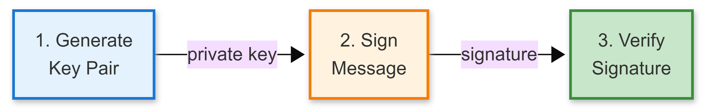

# Part 2: Hardware-Protected Digital Signatures

**Sign commands securely - Hardware-protected ECDSA without exposing private keys**

> **Part 2 of 3** | [Part 1: Attestation ←](https://github.com/nitikorn20/psoc-edge-optiga-01-attestation) | [← Back to Tutorial Hub](https://github.com/nitikorn20/optiga-tfm-connectivity-tutorials) | [Part 3: Secure Channel →](https://github.com/nitikorn20/psoc-edge-optiga-03-secure-channel)

[]()
[]()
[]()

---

## What You'll Build

A self-contained ECDSA signing demo that:
- ✅ Generates ECDSA P-256 key pairs
- ✅ Signs messages with hardware-backed keys
- ✅ Verifies signatures on-device

**Time:** 45 minutes | **Level:** Intermediate

**Why signing matters:** Authenticates commands and data without exposing private keys. See [Why Hardware Security Matters](https://github.com/nitikorn20/optiga-tfm-connectivity-tutorials#why-hardware-security-matters) for attack scenarios.

---

## How It Works

<div align="center">



</div>

**ECDSA P-256:**
- Standard elliptic curve (NIST secp256r1)
- 256-bit security level
- Used in Bitcoin, TLS, and IoT protocols

---

## Quick Start (5 Minutes)

### Prerequisites

**Hardware:**
- [PSoC™ Edge E84 Evaluation Kit (KIT_PSE84_EVAL_EPC2)](https://www.infineon.com/cms/en/product/evaluation-boards/kit-pse84-eval-epc2/)
  - Includes integrated **OPTIGA™ Trust M** chip (pre-configured)
- USB Type-C cable

**Software:**
- [ModusToolbox™ 3.6+](https://www.infineon.com/modustoolbox)
- Serial terminal (115200 baud, 8N1)

**Jumper Settings:**
- BOOT SW: **OFF**
- J20, J21: **NC** (not connected)

See [Hardware Setup Guide](https://github.com/nitikorn20/optiga-tfm-connectivity-tutorials#prerequisites) in Tutorial Hub for photos.

---

### Build and Run

```bash
# Build all projects
make -j8

# Program device
make program
```

### 3. Expected Output

Open serial terminal (115200 baud) and reset the board:

```
=======================================================
  OPTIGA Trust M - Digital Signatures (ECDSA)
  PSoC Edge E84 | TF-M Secure Platform
=======================================================

========== Step 1: Generate ECDSA Key Pair ==========
Generating EC P-256 key pair...
    [OK] EC P-256 key pair generated
    - Algorithm: ECDSA with SHA-256
    - Curve: NIST P-256 (secp256r1)

========== Step 2: Sign Message ==========
Message: "Hello World"
Signing with EC private key...
    [OK] Signature generated (64 bytes)

Signature (hex):
0x9c 0x37 0x5f 0x5a 0xe9 0xde 0x46 0x53 0xf6 0xd3 0xc8 0xda 0x10 0xf3 0xec 0xcf
0xb3 0xa0 0xd3 0x7e 0x11 0x16 0xe3 0xed 0x16 0xd4 0x11 0x00 0xcb 0x3b 0xef 0xc7
0x3d 0x1c 0x45 0x27 0xfe 0xbc 0xda 0x4b 0x69 0xcd 0x5e 0x30 0x29 0x59 0xc6 0x3d
0x62 0xc5 0xf9 0x4f 0x28 0x11 0x76 0xf2 0x40 0xa4 0xd3 0x44 0x3e 0x75 0x6d 0xbc

========== Step 3: Verify Signature ==========
Verifying signature with EC public key...
    [OK] Signature verified
    [OK] Message authenticity confirmed

=======================================================
  Demo completed successfully!
=======================================================
```

---

## Understanding Digital Signatures

### ECDSA Basics

Digital signatures provide:
- **Authentication**: Prove message origin
- **Integrity**: Detect tampering
- **Non-repudiation**: Sender cannot deny

This demo uses:
- **ECDSA** (Elliptic Curve Digital Signature Algorithm)
- **P-256** curve (secp256r1, NIST standard)
- **SHA-256** hash algorithm

### This Demo vs Production

| Aspect | This Demo | Production |
|--------|-----------|-----------|
| **Key Storage** | Ephemeral (volatile RAM) | Persistent (OPTIGA hardware) |
| **Key Lifetime** | Generated per-boot | Pre-provisioned, permanent |
| **Security** | Software-protected | Hardware-protected |
| **Verification** | On-device (self-test) | Remote (cloud server) |
| **Public key** | Internal only | Distributed via certificate |
| **Use case** | Learning ECDSA concepts | Device authentication |

⚠️ **Important Notes:**

**This demo focuses on teaching ECDSA signing algorithms** using ephemeral keys for simplicity. This approach:
- ✅ Perfect for learning signature generation/verification flow
- ✅ Shows PSA Crypto API usage patterns
- ❌ NOT production-ready (keys regenerated each boot)
- ❌ Private key exists in MCU RAM (not hardware-protected)

**For production systems:**
- Use **OPTIGA Trust M persistent device keys** (see Part 3)
- Private keys never leave secure hardware
- Unforgeable device identity
- Protection against physical attacks

**Progressive Learning Path:**
```
Part 1: OPTIGA IAK          → Hardware-rooted attestation
Part 2: Ephemeral ECDSA     → Algorithm concepts (you are here)
Part 3: OPTIGA Device Keys  → Production-ready security
```

**Production flow example:**
1. Device signs command/data with OPTIGA device key (hardware operation)
2. Cloud receives message + signature
3. Cloud verifies with device's registered public key certificate
4. Accept (valid) or Reject (invalid/tampered)

---

## Key Concepts

### Why ECDSA?

- **Smaller keys**: 256-bit ECDSA ≈ 3072-bit RSA security
- **Faster**: Efficient on embedded devices
- **Hardware accelerated**: OPTIGA Trust M support

### PSA Crypto API

Standard cryptographic API across platforms:

```c
// Generate key pair
psa_generate_key(&attributes, &key_id);

// Sign message
psa_sign_message(key_id, PSA_ALG_ECDSA(PSA_ALG_SHA_256),
                 message, msg_len, signature, sig_size, &sig_len);

// Verify signature
psa_verify_message(key_id, PSA_ALG_ECDSA(PSA_ALG_SHA_256),
                   message, msg_len, signature, sig_len);
```

---

## Project Structure

```
BLOG2_SIGNING/
├── proj_bootloader/    # Edge Protect Bootloader
├── proj_cm33_s/        # TF-M (Secure)
├── proj_cm33_ns/       # Main application
│   └── main.c          # ECDSA signing demo
├── proj_cm55/          # CM55 core
├── templates/          # Config templates
└── README.md           # This file
```

---

## Troubleshooting

<details>
<summary><strong>Device doesn't boot</strong></summary>

**Check:**
- BOOT SW in OFF position
- J20, J21 not connected
- USB cable to KitProg3 port

**Try:**
```bash
make clean_all
make -j8
make program
```

</details>

<details>
<summary><strong>Signature generation fails</strong></summary>

**Possible causes:**
- TF-M initialization failed
- PSA Crypto not initialized

**Solution:**
- Check TF-M boots correctly
- Verify `psa_crypto_init()` succeeded

</details>

---

## Related Resources

### Tutorial Series
- [Tutorial Hub](../optiga-tfm-connectivity-tutorials/)
- [Part 1: Attestation](../BASE/)
- [Part 3: Secure Channel](../BLOG3_SECURE_CHANNEL/) (coming soon)

### Documentation
- [PSA Crypto API](https://arm-software.github.io/psa-api/crypto/)
- [OPTIGA Trust M](https://www.infineon.com/optiga-trust-m)
- [TF-M Docs](https://tf-m-user-guide.trustedfirmware.org/)

---

## What's Next?

**Part 3: Secure Communication Channel**
- Secure channel establishment
- Session key derivation
- Encrypted messaging
- End-to-end security

---

## Next Steps

**✅ Completed Part 2!** You now understand ECDSA signature generation and verification.

**Continue learning:**
- [**Part 3: Secure Channel →**](https://github.com/nitikorn20/psoc-edge-optiga-03-secure-channel) - End-to-end encryption (90 min)
- [**Back to Part 1**](https://github.com/nitikorn20/psoc-edge-optiga-01-attestation) - Review attestation concepts

**Explore more:**
- [**Tutorial Series Hub**](https://github.com/nitikorn20/optiga-tfm-connectivity-tutorials)
- [**Why OPTIGA is Essential**](https://github.com/nitikorn20/optiga-tfm-connectivity-tutorials/blob/main/docs/why-optiga-trust-m.md)

---

## License

Apache License 2.0

**Copyright:**
- (c) 2024-2025, TESA Technology Co., Ltd.
- (c) 2024-2025, Infineon Technologies AG
